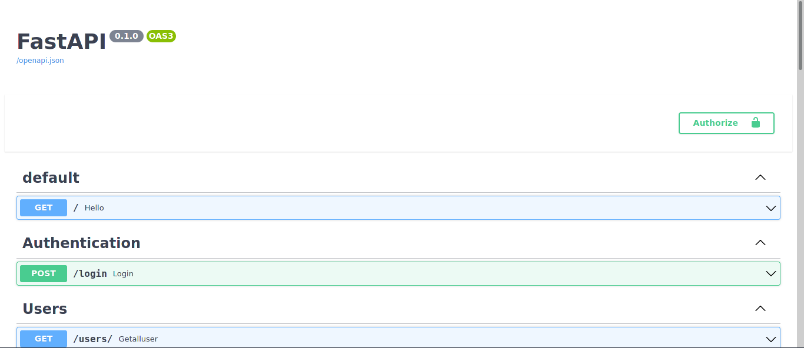
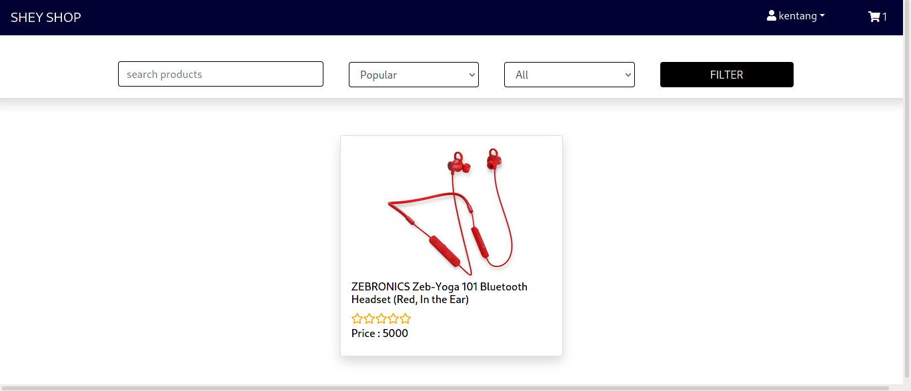
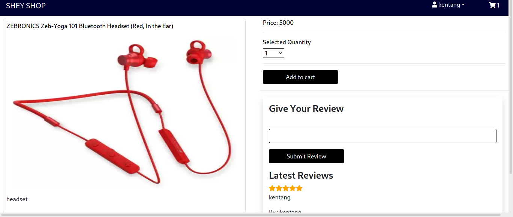
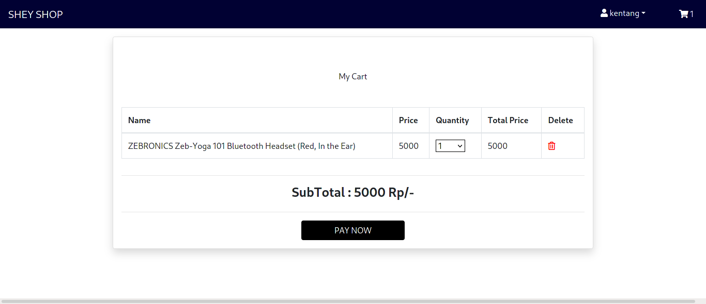
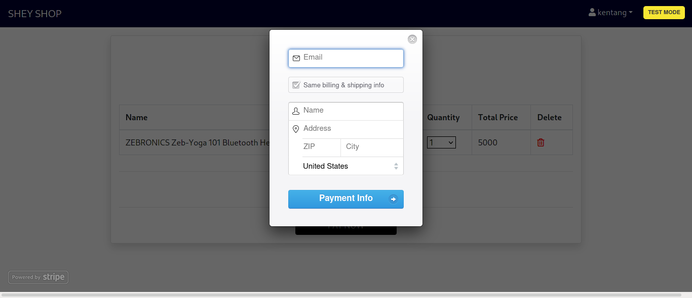
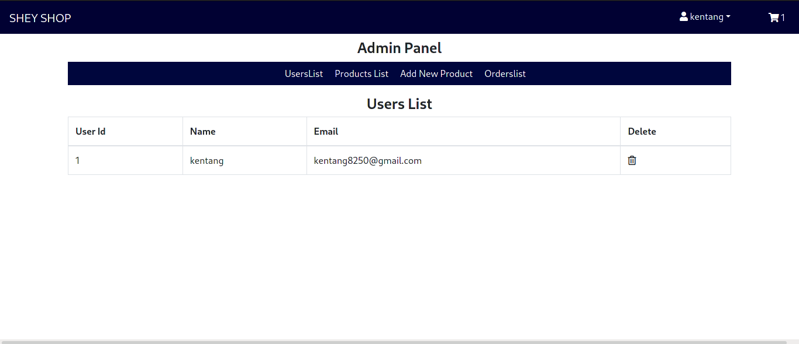
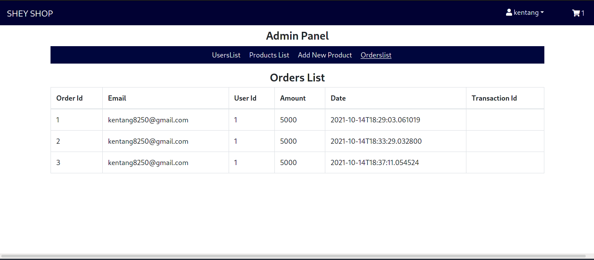

# Ecommerce React with Backend Fastapi

This is a simple project with Fastapi, sqlalchemy, react, redux, and Postgresql

## Routes Implement

url: http://localhost:8000/docs

## How to use My Project

<ul>
    <li>
        Install Python
    </li>
    <li>
        Install postgresql
    </li>
    <li>
        Install Pipenv pip install pipenv
    </li>
    <li>
        Install Npm and Nodejs
    </li>
    <li>
        git Clone my project https://github.com/renaldyhidayatt/ecomfastapireact
    </li>
    <li>
        directory project backend and pipenv install
    </li>
    <li>
        directory project frontend and npm install
    </li>
    <li>
        running project backend/app uvicorn main:app --reload
    </li>
    <li>
        running project frontend npm start
    </li>
</ul>

## Demo

Home

Show Product Byid

Cart Page

Order with Stripe

UserList page

ProductList PAge

OrderListPage

